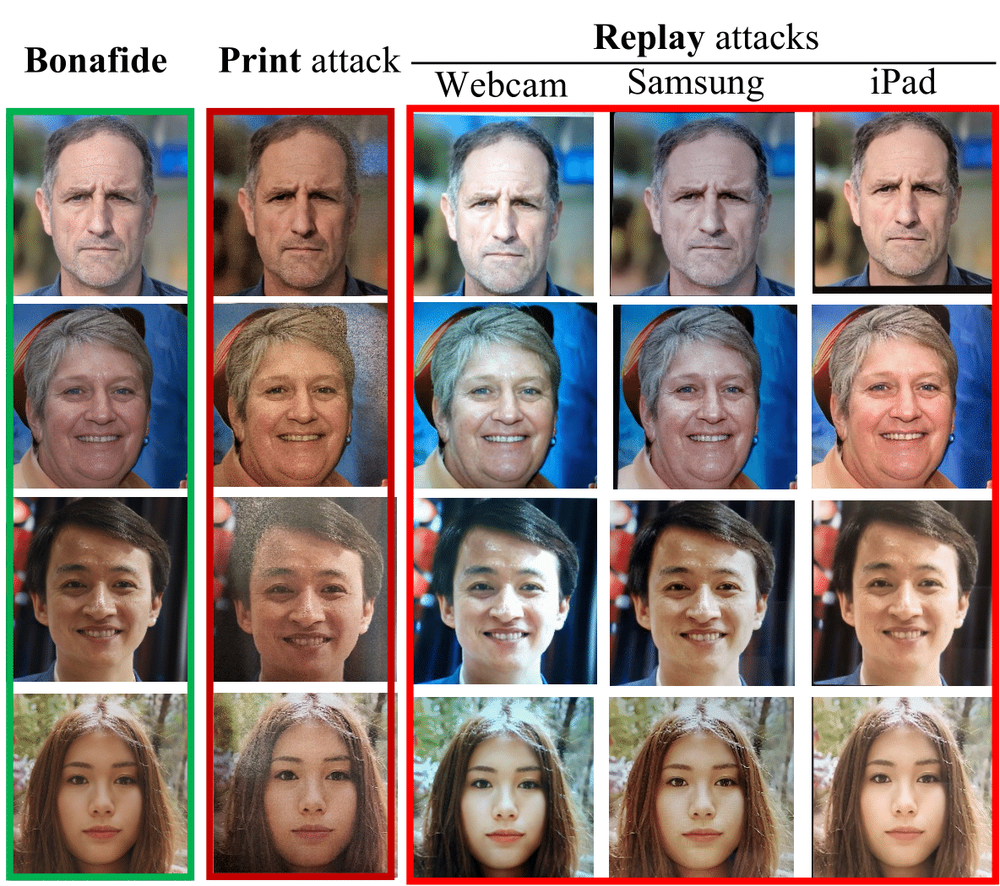

# SynthASpoof
---
## Note
This is the official repository of the work: SynthASpoof: Developing Face Presentation Attack Detection Based on Privacy-friendly Synthetic Data ([link])(https://arxiv.org/abs/2303.02660)

## SynthASpoof dataset
The SynthASpoof is the synthetic-based face presentation attack detection datasets, including synthetic-generated 25,000 bona fide images and 78,800 corresponding attacks collected by presenting the printed/replayed images to capture cameras (one mobile phone, two different tablets, and one webcam). The dataset can be downloaded via [owncloud](https://owncloud.fraunhofer.de/index.php/s/rDnDSrf7Zwg08gW).
The image samples in SynthASpoof are shown:




## Data preparation
SynthASpoof dataset: the images should be preprocessed including face detection and crop via **data_preprocess/crop_face.py** before training.

Test real datasets: for testing, we use four real face PAD dataset, MSU-MFSD, CASIA-FAS, Idiap ReplayAttack, and OULU-NPU.
The data format in the real face PAD datasets are videos. We sampled 25 frames in the average time interval of each video.  

Then, CSV files are generated for each dataset for further training and evaluation. The format of the dataset CSV file is:
```
image_path,label
/image_dir/image_file_1.png, bonafide
/image_dir/image_file_2.png, bonafide
/image_dir/image_file_3.png, attack
/image_dir/image_file_4.png, attack
```

## Training
Example of training:
```
python train.py \
  --csv_1 'SynthASpoof_data.csv' \
  --csv_2  'RealPAD_data.csv' 
```
The loss is computed based on csv_1. csv_2 is used for style transfer.

## Testing
Example of testing:
```
python train.py \
  --test_csv 'test_data.csv' \
  --model_path 'model.pth'
```
where test_data.csv contains image path and the corresponding label (bonafide or attack).

## Models
The models trained on SynthASpoof with MixStyle can be downloaded via [owncloud](https://owncloud.fraunhofer.de/index.php/s/HnXCtonG0vwfH11).


if you use SynthASpoof dataset in this repository, please cite the following paper:
```
@misc{synthaspoof,
  doi = {10.48550/ARXIV.2303.02660},
  url = {https://arxiv.org/abs/2303.02660},
  author = {Fang, Meiling and Huber, Marco and Damer, Naser},
  title = {SynthASpoof: Developing Face Presentation Attack Detection Based on Privacy-friendly Synthetic Data},
  publisher = {arXiv},
  year = {2023},
  copyright = {Creative Commons Attribution Non Commercial Share Alike 4.0 International}
}
```

## License
The dataset, the implementation, or trained models, use is restricted to research purpuses. The use of the dataset or the implementation/trained models for product development or product competetions (incl. NIST FRVT MORPH) is not allowed. This project is licensed under the terms of the Attribution-NonCommercial-ShareAlike 4.0 International (CC BY-NC-SA 4.0) license. Copyright (c) 2020 Fraunhofer Institute for Computer Graphics Research IGD Darmstadt.
